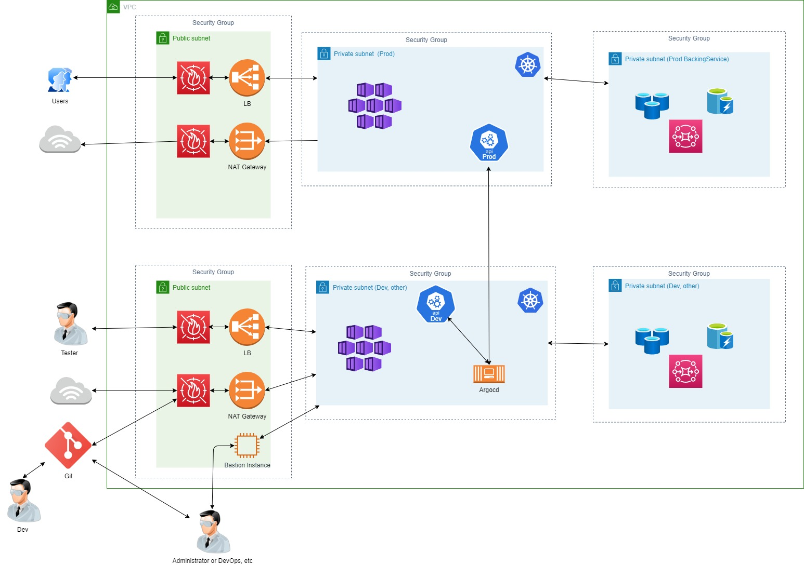

# Hand-On 1 จำลอง Application Development with multiple environments

## Architecture

อันนี้เป็นการจำลอง Architecture ที่ผมเคยใช้ทำในองค์กร ซึ่งทำให้ Flow ในการ Deploy Application ได้เร็ว และความผิดพลาดน้อย

โดยการทำงานคือ เราจะแบ่งเป็น 2 kube ผั่งและแบ่ง subnet ย่อยลงไปและใช้ Security group ในการ Isolate network ออกจากกัน

kube ที่ฝั่ง Dev จะลง Argocd ไว้ เพื่อให้สะดวกในการ Deploy โดย argocd ก็จะเชื่อมต่อกับ kube api ฝั่ง prod ไว้ด้วยเพื่อที่จะสามารถอัพเดท Software ขึ้นไปได้

ส่วน Git ผมใช้ GitLab ในการเก็บ Code ไว้ และแบ่งสิทธิ์การเข้าถึงไว้ ระหว่างที่เป็น code ที่ deploy infra และ code ที่เป็น Application

ส่วน Secret ผมใช้ Secret Manager ในการเก็บและจะมีสิทธิ์การเข้าถึงและใช้งานต่างกันไป

## CI/CD

https://gitlab.com/puksigon/netfivesimple
http://app2-dev.saxnio.com

อันนี้เป็นตัวอย่างที่ใช้ Gitlab CI ในการสร้าง Pipeline ในตัวอย่างนี้ แตกต่างจากที่ผมใช้จริงๆ คือ Code ที่ใช้ Deploy จะแยก ออกจาก Application Repo จริง ๆ คิดว่าจะทำ Helm Chart แต่ดูแล้วน่าจะไม่ทัน เลยเอาเท่าที่ได้ก่อน

โดยผมสร้าง มา 3 stage หลักๆ ก่อนคือ

1.  owasp scan
2.  Create Semver
3.  Build

จริงๆ มีส่วน Auto deploy ด้วย แต่ว่าในที่นี้ผมใช้เป็น manual ไปก่อน

ส่วน Kube อันนี้ผม Deploy ไว้ที่ Server ผมเอง แบบง่ายๆ ไปก่อนครับ ใช้ RKE2 ในการ Provision
